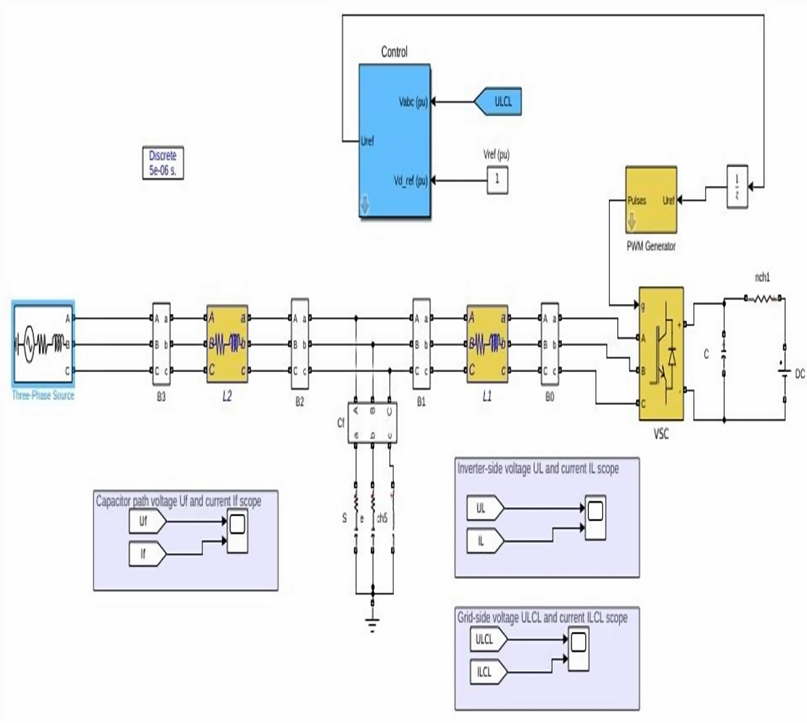
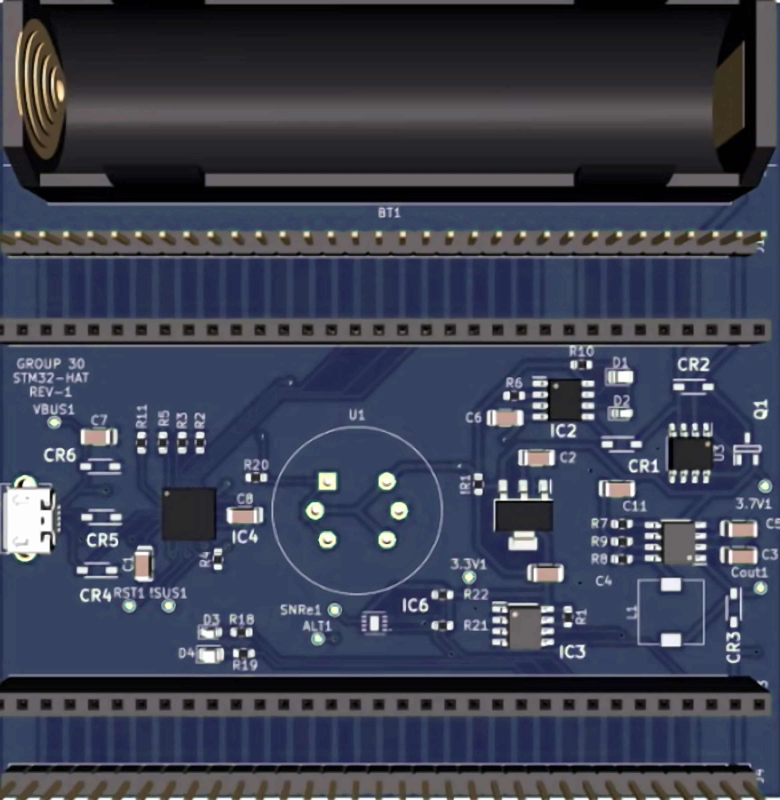
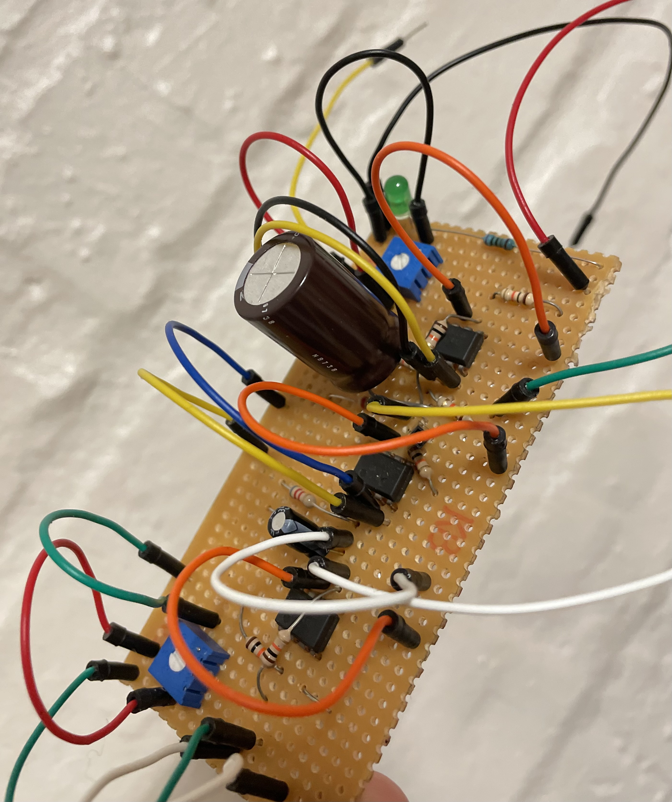

#### Technical Skills: MS Project, Python, KiCad, Visio, Excel, MATLAB, D365

## Education					       		
- B.S.c Eng. in Mechatronics	| The University of Cape Town (UCT) (_March 2025_)	 			        		
- Matric Certificate          | Kwa-Bhekilanga Sec School (_Jan 2019_)

## Work Experience
**Project Engineer, Operations -- Graduate @ Motus Aftermarket Parts (_June 2025 - Aug 2026_)**
- Designed end-to-end warehouse layouts and process flows for new sites, applying bin optimisation and strategic product grouping -- improving OTIF performance by 15% and service delivery
- Improved inventory positioning using Pareto analysis principles, reducing picker travel distance by 20% and increasing
accessibility of fast-moving inventory.
- Managed outsourced pallet storage capacity, coordinating product selection and quantities to optimise space utilisation while
maintaining onsite efficiency for high-turnover stock.

**Mechanical Engineering Vac Student @ Cape Peninsula University of Technology (_Nov 2021 - Dec 2021_)**
- Gained hands-on training in arc welding, fitting and turning (lathes), robotics, induction machines and wiring diagrams, and
pneumatic systems during the CPUT 6-week programme, strengthening practical engineering skills alongside academic theory.

## Projects
### Variable filter design for grid-connected inverter systems
[Publication](https://www.mdpi.com/1424-8220/22/8/3048)

Developed objective strategy for discovering optimal EEG bands based on signal power spectra using **Python**. This data-driven approach led to better characterization of the underlying power spectrum by identifying bands that outperformed the more commonly used band boundaries by a factor of two. The proposed method provides a fully automated and flexible approach to capturing key signal components and possibly discovering new indices of brain activity.

### Environmental monitoring system for raptor nesting sites 
Developed objective strategy for discovering optimal EEG bands based on signal power spectra using **Python**. This data-driven approach led to better characterization of the underlying power spectrum by identifying bands that outperformed the more commonly used band boundaries by a factor of two. The proposed method provides a fully automated and flexible approach to capturing key signal components and possibly discovering new indices of brain activity.

### Air quality monitor hardware-on-top (HAT) for STM32FODiscovery board
Developed objective strategy for discovering optimal EEG bands based on signal power spectra using **Python**. This data-driven approach led to better characterization of the underlying power spectrum by identifying bands that outperformed the more commonly used band boundaries by a factor of two. The proposed method provides a fully automated and flexible approach to capturing key signal components and possibly discovering new indices of brain activity.

### Helicopter altitude control system
Developed objective strategy for discovering optimal EEG bands based on signal power spectra using **Python**. This data-driven approach led to better characterization of the underlying power spectrum by identifying bands that outperformed the more commonly used band boundaries by a factor of two. The proposed method provides a fully automated and flexible approach to capturing key signal components and possibly discovering new indices of brain activity.

  

## Relevant courses

  <b>Varsity Courses</b>

